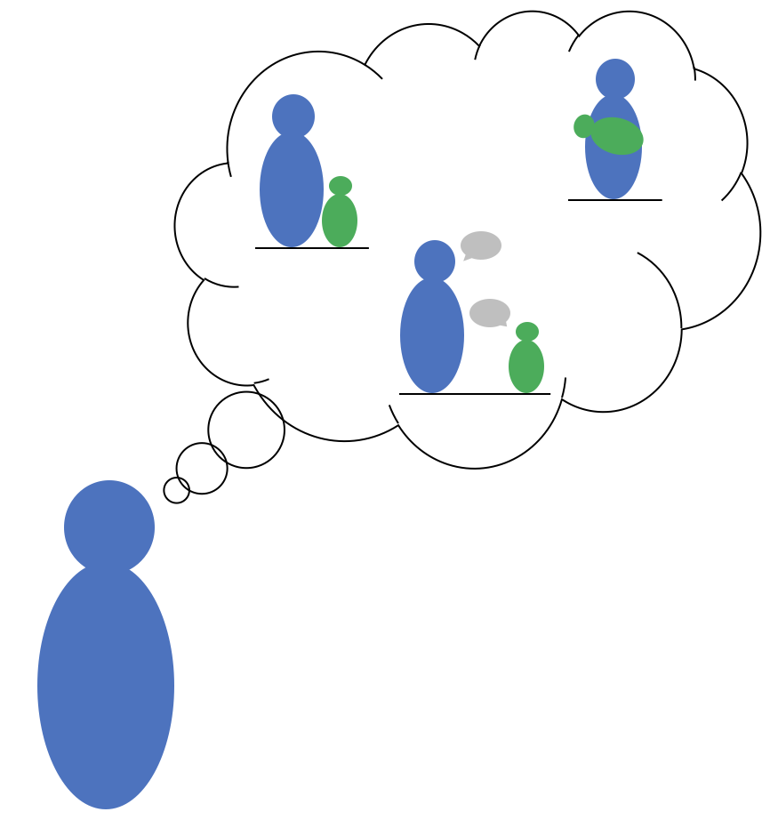

## About the EPAQ

The Early Parenting Attitudes Questionnaire (EPAQ) is a short, psychometrically-valid instrument for assessing adults' beliefs about parenting and child development. The PAQ measures three subscales: **rules and respect**, **affection and attachment**, and **early learning**. Our goals in designing the EPAQ were to create a short instrument that could 1) measure population-level differences in attitudes, 2) be used as a moderator in experimental and intervention studies on caregiving behaviors, and 3) be used as an outcome variable for caregiving belief- and behavior-change interventions.

The PAQ has 24 items (8 per subscale, 12 reverse coded) and can be given online or on paper. Spanish and French translations are available, but have not been validated as extensively. It has subscale reliabilities of alpha = .69 (rules and respect), .75 (affection and attachment), and .76 (early learning), respectively. 

Scale construction and validity evidence is described in [Hembacher & Frank (2020), Collabra: Psychology](https://www.collabra.org/article/10.1525/collabra.190/).

## Materials and Translations

## Main versions

[PDF version of the EPAQ](https://drive.google.com/file/d/1imxrvppP1-Efl4T0-n-JX5HWSBDxseKj)
[Word verson of the EPAQ](https://docs.google.com/document/d/1YZcAfGQ4SA8N3B-JpUtK4lp9lq7hPAn2)

[Google forms English version of the EPAQ](https://drive.google.com/open?id=12_6uMkoPapp5-AW6hpSQ8bAwx6vq-5oZOhUZH4dFgjk) - Note, please MAKE A COPY of the EPAQ form rather than trying to edit this one directly (or using it to collect your own data!).

### Translations

* [Spanish](https://drive.google.com/open?id=1yRye8nYAlwYQVPOgTYf-pqgAoH1O00zPuo5JA9_QQ-M)
* [French](https://docs.google.com/document/d/1meKyKWf11o6JwekyOFyMe0NqNjEZEJFg) - courtesy of Rebecca Shankland and Christina Bergmann 
* [Danish](https://drive.google.com/file/d/1D9XK6QA9EwqpbrDtG_I1lhCCGE2zTBYF) - courtesy of Christina Dideriksen, note four extra questions about child-directed speech at the end
* [Russian](https://drive.google.com/file/d/17jA8tKuWwOlDPAbD-Kd1Q4pC3j-4Bnao/view?usp=sharing) - courtesy of Natalia Kartushina and Margarita Gavrilova

We are very happy for you to translate the form, but we ask that you share it back to us for posting on this website. We also ask that you maintain the CC-BY 4.0 license as shown below.

## Contact and Acknowledgements

Research and development of the EPAQ was supported by a generous gift from [Kinedu](https://www.kinedu.com/).

The original repository for the paper can be found [here](https://github.com/langcog/parenting_proj) and [an OSF repository](https://osf.io/pb3a4/) archives some raw materials and preprints. 

For more information, contact [Michael Frank](http://web.stanford.edu/~mcfrank/).

## License

 This work is licensed under a <a rel="license" href="http://creativecommons.org/licenses/by/4.0/">Creative Commons Attribution 4.0 International License</a>. It can be shared and adapted, but you must acknowledge the original by citing the paper above. 
