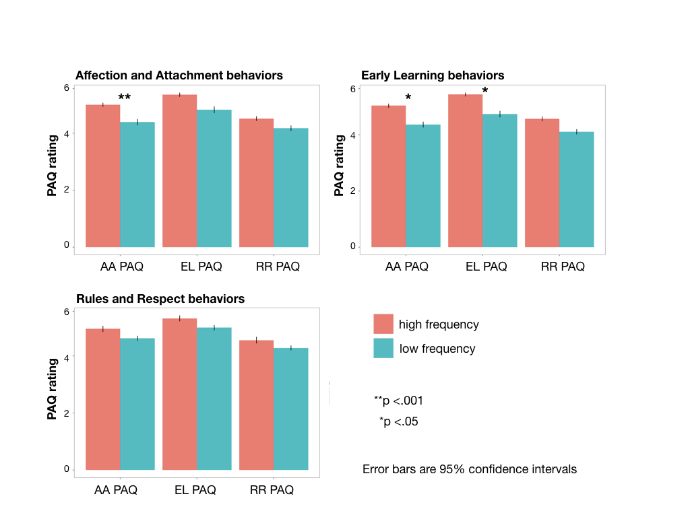

# Relationship of parenting attitudes to self-reported caregiving behaviors

Do parents' attitudes about parenting and child development predict their self-reported caregiving behaviors?

## Method

250 parents of young children (ages 0-5 years) were recruited on Amazon's Mechanical Turk. They completed the Parenting Attitudes Questionnaire (PAQ) and rated how frequently they engaged in 12 caregiving behaviors predicted to relate to early learning, affection and attachment, or rules and respect theories as assessed by the PAQ.

## Results

How often do parents report engaging in different caregiving behaviors?

Do parents' agreement with the early learning, affection and attachment, and rules and respect theories predict the frequency of their behaviors in these domains?

## Conclusions

* Lay parenting theories are associated with the frequency of specific parenting behaviors (in particular those associated with affection and attachment and early learning).
* Interventions on parenting behaviors might consider targeting lay parenting theories.