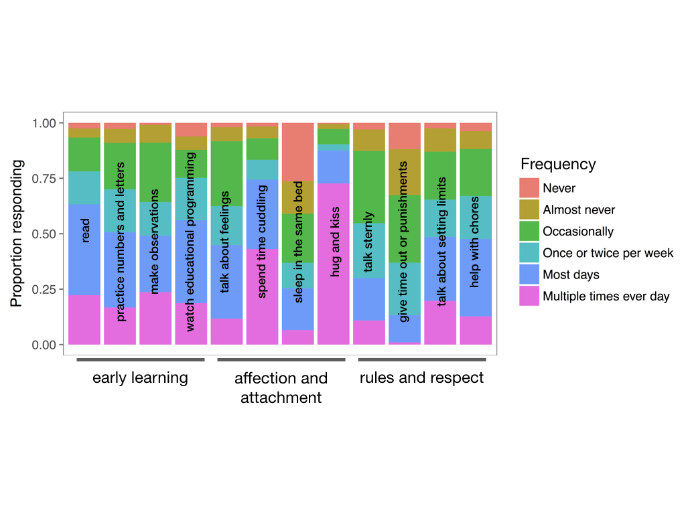

# Relationship of parenting attitudes to self-reported caregiving behaviors

Do parents' attitudes about parenting and child development predict their self-reported caregiving behaviors?

## Methods

250 parents of young children (ages 0-5 years) were recruited on Amazon's Mechanical Turk. They 1) completed the Parenting Attitudes Questionnaire (PAQ) and 2) rated how frequently they engaged in 12 caregiving behaviors predicted to relate to early learning (EL), affection and attachment (AA), or rules and respect (RR) theories as assessed by the PAQ.

## Results

How often do parents report engaging in different caregiving behaviors?

Do parents' agreement with the EL, AA, and RR theories predict the frequency of their behaviors in these domains?

Logistic mixed-effects regressions predicting the frequency of behaviors (*low* = never, almost never, occasionally, once or twice per week vs. *high* = most days, multiple times every day) were fit for each category separately. The frequency of AA behaviors was predicted uniquely by AA PAQ scores, and the frequency of EL behaviors was predicted by both AA and EL PAQ scores. There were no significant predictors of RR behaviors.

## Conclusions

* Lay parenting theories are associated with the frequency of specific parenting behaviors (in particular those associated with affection and attachment and early learning). 
* The rules and respect behaviors we chose to examine were not related to scores on the PAQ. These particular behaviors may be more related to child characteristics, or may be frequent even among parents who do not prioritize rules and respect in particular. 
* Interventions on parenting behaviors might consider targeting lay parenting theories.

More information and analytic code can be found [here](http://rpubs.com/ehembacher/parenting_proj_behaviors).