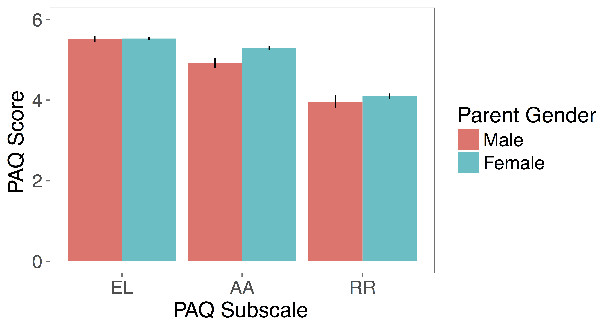

# Correlations with demographic variability

Do parents' attitudes about parenting and child development vary based on demographic factors?

## Methods

680 parents from the membership list of the Children's Discovery Museum in San Jose completed the Parenting Attitudes Questionnaire (PAQ) and provided us with demographic information about their families. 

## Results

### Gender 

Mothers score higher on the affection and attachment (AA) subscale compared to fathers. Attitudes about early learning (EL) and rules and respect (RR) do not vary based on gender. 

Parents score lower on the AA subscale with age. The other subscales (EL and RR) do not vary based on parent age.

## Conclusions

Additional information and analytic code can be found [here](http://rpubs.com/ehembacher/parenting_proj_cdm).