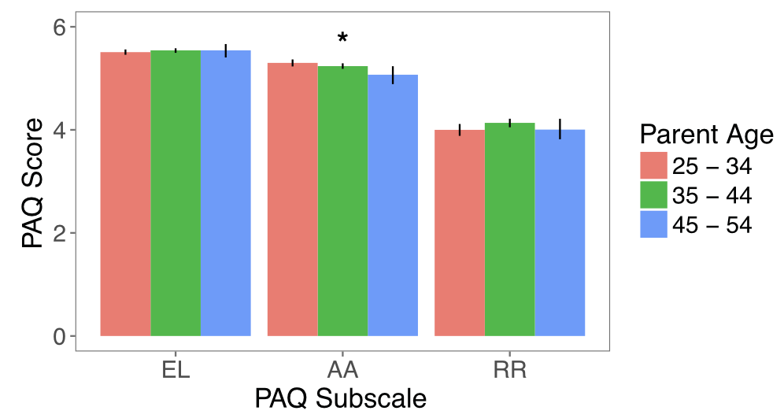

# Correlations with demographic variability

Do parents' attitudes about parenting and child development vary based on demographic factors?

## Methods

680 parents from the membership list of the Children's Discovery Museum (CDM) in San Jose completed the Parenting Attitudes Questionnaire (PAQ) and provided us with demographic information about their families. 

## Results

Linear mixed-effects models were fit to estimate whether demographic factors predicted scores on the early learning (EL), affection and attachment (AA), and rules and respect (RR) subscales. 

**p<.001 *p<.05

### Parent gender 

Mothers score higher on the affection and attachment (AA) subscale compared to fathers. Attitudes about early learning (EL) and rules and respect (RR) do not vary based on gender. 

### Parent age

Parents score lower on the AA subscale with age. The other subscales (EL and RR) do not vary based on parent age.

### Parent education

Parents with higher levels of education score lower on the RR subscale. The other subscales (EL and AA) do not vary based on parent education.

### Number of children

Parents with a greater number of children score higher on the RR subscale. The other subscales (EL and AA) do not vary based on the number of children in the family.

### Ethnicity

Asian and Hispanic parents score higher on the RR subscale compared to White parents. The other subscales (EL and AA) do not vary based on parent ethnicity. 

### Comparison with an online sample

Do parents who are members at a children's museum differ in their parenting attitudes compared to a nationwide sample? The responses of parents from the CDM membership list were compared with two samples of 250 participants each recruited on Amazon's Mechanical Turk. CDM parents endorsed 

## Conclusions

* Endorsement of the RR subscale (i.e., belief that behavioral control and respect for authority are a priority for caregiving) was higher among parents with a greater number of children, and Asian and Hispanic parents. It was lower among parents with higher levels of education. 
* Endorsement of the AA subscale (i.e., belief in fostering close emotional bonds with children) was higher among females and lower among older parents. 
* While endorsement of the EL subscale (i.e., belief that encouraging early learning and cognitive development is a priority) did not differ based on the demographic factors we queried, parents who were members of a children's museum endorsed the EL subscale to a greater extent than two nationwide samples. 
* Parents who were members of a children's museum also endorsed the AA subscale to a greater extent, and the RR subscale to a lesser extent compared to the nationwide samples.
* These findings suggest that attitudes about parenting and child development vary based on demographic factors, and should be considered when designing interventions on caregiving.

Additional information and analytic code can be found [here](http://rpubs.com/ehembacher/parenting_proj_cdm).